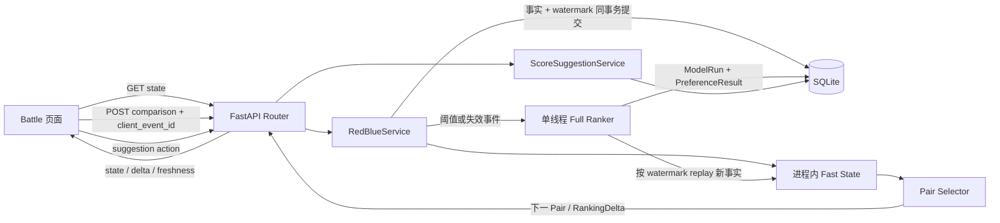

# 红蓝合战：阶段 8 综合设计

> 本文是当前实现的综合说明。分阶段技术文档保留其对应阶段的实验记录；涉及当前数据流、参数和限制时，以本文与源码为准。

## 产品语义

红蓝合战为当前用户已评分、公开且未软删除的番剧建立个人偏好排名。用户针对系统给出的一对作品提交“更喜欢左方”“更喜欢右方”“差不多”或“跳过”。排名依据不可变的 PK 事实和当前 Score Anchor 计算；当前评分建议不会反向作为自己的训练标签。

页面显示的 `rank` 是当前完整候选集内连续的整数序号。`expected_rank` 是后验统计量，可以是小数，只用于建模、区间与分析，不直接充当 UI rank。分页、搜索和筛选仅改变可见行，不会重排或重编号全局排名。

## 数据流

主要端点位于 `/api/v1/red-blue/`：

- `GET /state` 返回当前 Pair、排名页、状态版本、Freshness、建议及后台校准状态。
- `POST /comparisons` 保存 LEFT / RIGHT / TIE / SKIP，返回下一 Pair、排名变化和建议增量。
- `GET /comparisons` 与 `POST /comparisons/{id}/revoke` 读取/撤销事实；撤销保留原记录并要求 Full。
- `POST /score-suggestions/{id}/actions` 接受、忽略或拒绝建议；动作有独立幂等键。

普通比较限流默认为每用户和 IP 各 120 次/60 秒。API 使用 cookie 认证和明确的 Pydantic request/response model。

## 事实、派生状态和前端暂态

| 类型 | 数据 | 生命周期 |
| --- | --- | --- |
| 事实 | `red_blue_comparisons` | 不物理删除；revoke 写 `revoked_at`；`(user_id, client_event_id)` 唯一 |
| 用户输入 | `ratings.score_anchor`、`rating_revisions` | 手工评分/正式评分输入产生新的锚点修订 |
| 派生 Full 快照 | `preference_model_runs`、`preference_results` | 可从事实重算；以比较、评分锚点、revoke、候选集和配置水位判断兼容性 |
| 派生建议 | `score_suggestions` | 对当前可展示建议做 reconciliation；不替代用户动作事实 |
| 用户动作事实 | `score_suggestion_actions`、关联 `rating_revisions` | ACCEPTED / DISMISSED / REJECTED 的审计与幂等事实；删除派生快照时仍可保留 |
| 进程缓存 | `RuntimeFastState` / `FastPreferenceState` | 仅内存；进程重启后从兼容 Full 快照恢复并 replay 后续事实 |
| 页面暂态 | `current_pair`、Focus、待提交状态、RankingDelta | 页面本地状态；重新加载会重新获取 Pair，Focus 不跨页面重载保存 |

一次 Comparison 的数据库事实和 `comparison_state_version` 在同一事务提交。Fast Update、RankingDelta、Selector 和网络响应发生在事实提交之后；进程在提交后中断时，下一次状态读取根据 watermark replay，不丢失事实。重复相同 event 与 payload 幂等成功；相同 event 携带不同 payload 返回 409。

## Ranker、展示排名和稳定度

Full Ranker 使用 Davidson 平局模型、Score Anchor prior、MAP/Laplace 后验和完整协方差采样。基础 prior precision 以 50 个候选、0.001 为基准，按 (50/N)^2 随候选池规模缩放，避免大榜的全局正则化压扁清晰的局部顺序。Fast Update 对普通 LEFT / RIGHT / TIE 做局部增量；SKIP 不改变 preference mean，但保留为 Selector 历史。

Full 和 Fast 都先按偏好均值形成确定性展示顺序，再由后端产生 `1..N` 唯一整数 rank。技术层 content ID 只在均值相同时提供可重复 tie-break，不构成额外偏好证据。`expected_rank` 保持浮点统计语义。

位置稳定性和邻近顺序不确定是两个字段：

- `UNCALIBRATED`、`CALIBRATING`、`RELATIVELY_STABLE`、`STABLE` 描述证据数量和 rank interval 宽度。
- `order_uncertain` 表示附近作品的先后难以确认。Rank interval 重叠或期望排名接近时，检查后验顺序置信度；成对比较数不足或置信度达到阈值时不触发。
- `order_uncertain=true` 不覆盖基础 stability；例如 `STABLE` 与 `order_uncertain=true` 可以同时成立。
- 从旧快照恢复时，legacy `ORDER_UNCERTAIN` 会规范化成独立的稳定度与不确定标记；当前代码按已保存的均值、区间及比较次数重建邻近判断。

当前阈值保存在 `RankerConfig` 并随 Full 运行写入 `algorithm_config_json`。默认稳定性阈值为：relatively stable 至少 3 次比较且区间宽度不超过 6；stable 至少 8 次且宽度不超过 2。邻近不确定默认要求双方至少 2 次比较、后验顺序置信度低于 0.60，并且 rank interval 重叠或期望名次距离不超过 2；当前实现不使用平局概率作为触发代理。

## Pair Selector 与 Focus

Selector 依据覆盖不足、后验不确定性、rank interval 邻接、比较图连通性、重复 pair 冷却、跳过历史和近期曝光选择下一对。普通 coverage 目标按候选规模的 `ceil(log2(N))` 伸缩并限制为每个作品 4–8 次；选择时维持低覆盖 envelope，同一 unordered pair 普通模式最多 5 次、Focus 目标最多 8 次。全历史无序 Pair 计数独立于近期窗口。

Focus 是当前选择请求的临时上下文：集中目标作品进行比较，但不会写入 Comparison 事实；结束 Focus 后恢复普通覆盖选择。当前 active Pair 由页面状态持有，服务端 POST 返回下一 Pair，不会在普通 polling 中主动换题。

## Score Anchor 与 Score Suggestion

Ranker 只将 `score_anchor` 当作先验训练输入。正常 Rating 更新会建立新的 revision 并推进 Anchor 水位；接受 PK 建议只更新 `Rating.score`，以 `pk_suggestion` revision 记录来源，不推进 Anchor，避免“建议分数—排名 prior—建议分数”的自反馈环。

评分校准使用偏好后验、独立 Anchor、当前分数、局部样本支持和置信区间。只有可操作建议进入 `PENDING` 集合，排名 API 将建议挂到对应 Ranking Row；前端只对 `score_suggestion != null` 的行显示建议卡片。

- `ACCEPTED`：更新当前评分并保留 Anchor；RatingRevision 指向建议和动作。
- `DISMISSED`：不改评分，按抑制规则暂时隐藏；跳过比较不算新证据。
- `REJECTED`：不改评分，对同一 suggestion key 持久抑制。
- Suggestions 是可重建派生记录；Actions 与评分修订是用户事实。

当前校准默认要求较成熟且稳定的模型；建议数量、置信度、严重度、五分步长、抑制时间和滞回阈值由 `ScoreCalibrationConfig` 控制，不在 UI 端另行推断。

## Full / Fast、一致性与恢复

普通比较在当前 Fast State 上快速更新。默认每 10 次 Fast Update 请求一次 Full；Anchor、revoke、候选集、算法配置变化及缓存过期会直接令当前状态要求 Full。`max_fast_updates_before_full` 可用 `MOREANI_RED_BLUE_MAX_FAST_UPDATES` 配置。

Full 工作线程先冻结输入及所有 watermark，随后在事务外运行 CPU Ranker，最后保存完成快照。运行期间只新增 comparison 时，Full 完成后按 ID replay 快照边界之后的事实；Anchor、revoke、候选集或配置变化时，旧结果不应用为当前兼容基准，并至多为该用户安排一个 follow-up Full。相同输入的 state polling 不重复排队 Full。

`RUNNING` 超过 stale 阈值后，在状态访问时恢复为 `FAILED`。进程重启会清空内存 Fast Cache；首次 GET 使用最新兼容 Full 快照及后续 replay 重建，若找不到兼容快照则从 Anchor bootstrap 并要求 Full。Fast 更新只负责临时排序，Full 稳定度/区间作为权威字段保留。

## 前端状态和校准反馈

Ranking Row 使用后端整数全局排名。LEFT / RIGHT / TIE 的 `RankingDelta` 留在当前页面，直到下一次有效 PK 替换；等待、SKIP、搜索、筛选、Focus、Sticky、详情、Suggestion Action 和 Full polling 不清除它。Refresh / Revoke 可清除。

Fast 后台 Full 到达时，若 display rank 不变，只更新 uncertainty、stability 和 suggestion。若 rank 改变，显示“排名已重新校准”与受影响行的“校准调整”；Full 的变化不伪装成 PK 的 ↑ / ↓。

Sticky Mini Battle 和主 Battle 共享当前 Pair 与提交状态。快捷键为 A/← LEFT、D/→ RIGHT、S/↓ TIE、W/↑ SKIP；输入控件、对话框/菜单交互、pending mutation 和重复按键不会提交，方向键作为 PK 输入时阻止页面滚动。

V1 使用普通 HTTP polling，没有 SSE/WebSocket 推送。页面显示 Full 完成状态的更新间隔为前端查询配置值；用户停止轮询时仍可通过下一次状态读取获取快照。

## 数据库迁移

应用启动先创建当前 ORM 表，再按 `schema_migrations` 顺序执行 0001–0014。执行器在迁移成功后记录 revision，失败时停止启动且不记录失败 revision。`0012-red-blue-score-suggestion-key-uniqueness` 将历史 suggestion 唯一语义升级为 `(model_run_id, user_id, content_id, suggestion_key)`；若中断后同时残留 `score_suggestions_legacy` 与新表，下次启动会先补回旧行、移除临时表，再确保当前索引。0013 为排名快照添加独立的 `order_uncertain`；0014 安全合并并清理旧订阅迁移留下的 legacy 表。

不得修改已执行迁移的最终 schema 语义。后续结构变动应新增 revision。空库启动、旧评分/修订保留、`score_anchor` 回填、部分红蓝迁移、0012 中断恢复、旧订阅表中断恢复和重复启动均通过隔离数据库验证。

## 部署限制与已知边界

- 当前 V1 部署使用一个 Uvicorn worker：限流状态、Full 协调锁和 Fast Cache 都是进程内；SQLite 也不适合多 worker 并发写。不要将当前实现描述为多 worker 安全。
- Fast Cache 的状态随进程重启丢失，但可从 DB Full Snapshot 与 Comparison 事实恢复；客户端 `current_pair` 和 Focus 是页面暂态。
- 没有后台推送通道；页面依赖请求和 Full 状态 polling 更新。
- Full Ranker 使用完整协方差；大候选池性能以本阶段的真实 benchmark 为准，不凭 jsdom 时间推断 Chromium 体验。
- Selector acquisition 是带覆盖与邻近启发式的候选 shortlist，不等价于完整 posterior 下的全局最优 Expected Information Gain。
